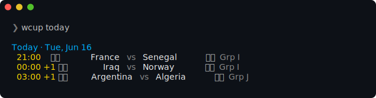
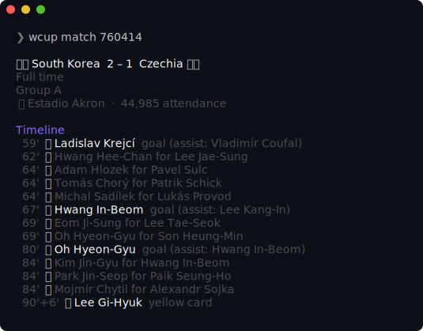
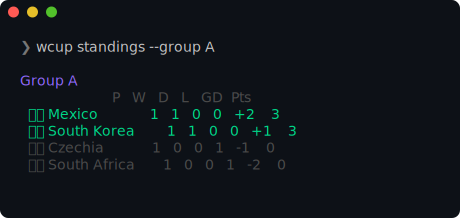

# wcup

Follow the **2026 FIFA World Cup** from your terminal — live scores, schedule,
standings, and teams. No account, no API key, no browser.

<p align="center">
  
</p>

Data comes straight from ESPN's public soccer API — completely free and
unauthenticated.

The command is `wcup` (the repo is `wc-cli`).

## Install

### Go (any platform)

```sh
go install github.com/bdagnino/wc-cli/cmd/wcup@latest
```

### Binaries

Grab a prebuilt binary for your platform from the
[releases page](https://github.com/bdagnino/wc-cli/releases), unpack it, and put
`wcup` on your `PATH`.

### Homebrew (macOS / Linux)

> Enabled once the maintainer publishes the formula (see [Releasing](#releasing)).

```sh
brew install bdagnino/tap/wcup
```

## Usage

Run `wcup` with no arguments for a smart summary — what's **live now**, else
**today's** matches, else the **next** ones up.

| Command | What it shows |
| --- | --- |
| `wcup` | Smart summary (live → today → next) |
| `wcup today` | Today's matches, with live scores |
| `wcup live` | Only matches in progress right now |
| `wcup next` | The next upcoming match |
| `wcup schedule` | Upcoming fixtures across the tournament |
| `wcup results` | Recently finished matches |
| `wcup standings` | Group tables |
| `wcup bracket` | Knockout bracket |
| `wcup match` | Detail for a live / featured match |
| `wcup team <name>` | A team's fixtures, results, and group |
| `wcup teams` | List all teams (or search for one) |

### Match detail

`wcup match <id|team>` shows the scoreline plus a goal/card/substitution
timeline and game info. With no argument it picks the live or featured match.

<p align="center">
  
</p>

### Standings

<p align="center">
  
</p>

### Filters

`schedule`, `results`, and `next` accept:

```sh
wcup schedule --team brazil          # by team (name or 3-letter code)
wcup schedule --group F              # by group
wcup schedule --date tomorrow        # today | tomorrow | YYYY-MM-DD
wcup schedule --round qf             # group | r32 | r16 | qf | sf | final
wcup next --team ARG -n 3            # limit how many show
```

Don't know a team's name or code? Search for it:

```sh
$ wcup teams cong
  🇨🇩 COD Congo DR
```

### Live mode

Add `--watch` (`-w`) to refresh in place every 30 seconds:

```sh
wcup live --watch
```

### Global flags

| Flag | Effect |
| --- | --- |
| `--tz <zone>` | Show kickoff times in a timezone (e.g. `Europe/Madrid`); defaults to local |
| `--json` | Machine-readable output for scripting |
| `--no-color` | Disable colors (also respects `NO_COLOR`) |

## Use with Claude Code / AI agents

This repo ships a [Claude Code](https://claude.com/claude-code) skill so an agent
can answer World Cup questions by running `wcup` for you — ask *"when does
Argentina play next?"* and it runs the right command and reads back the answer.

The skill lives at [`.claude/skills/world-cup/SKILL.md`](.claude/skills/world-cup/SKILL.md).
It is picked up automatically when an agent runs inside a clone of this repo. To
use it anywhere (e.g. alongside a `brew`/`go install`ed `wcup`), copy it into
your user skills directory:

```sh
mkdir -p ~/.claude/skills/world-cup
curl -fsSL https://raw.githubusercontent.com/bdagnino/wc-cli/main/.claude/skills/world-cup/SKILL.md \
  -o ~/.claude/skills/world-cup/SKILL.md
```

## How it works

`wcup` reads ESPN's public, unauthenticated soccer endpoints. The data source
sits behind a small `Provider` interface, so additional backends could be added
without touching the command layer.

## Development

```sh
go build -o bin/wcup ./cmd/wcup   # build
go vet ./...                      # lint
go test ./...                     # test
./bin/wcup today                  # run
```

Requires Go 1.23+.

## Releasing

Tagging a version triggers GitHub Actions + GoReleaser, which publishes
cross-platform binaries and a GitHub Release:

```sh
git tag -a v0.1.2 -m "wcup v0.1.2" && git push origin v0.1.2
```

**Homebrew (one-time setup).** The release also publishes a formula to
`bdagnino/homebrew-tap`, but only if a token is configured — otherwise that step
is skipped and binary releases still succeed. To enable it, create a
fine-grained personal access token with **Contents: read & write** on the
`homebrew-tap` repo, then:

```sh
gh secret set HOMEBREW_TAP_GITHUB_TOKEN --repo bdagnino/wc-cli   # paste the token
gh run rerun --repo bdagnino/wc-cli $(gh run list --workflow=release.yml -L1 --json databaseId --jq '.[0].databaseId')
```

After that, `brew install bdagnino/tap/wcup` works.

## License

[MIT](LICENSE)
